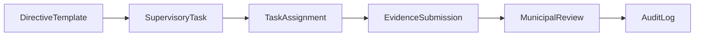

# Architecture

High-level technical design for GovLink. For active missions and task status, see [.cursor/MISSION-BOARD.md](../.cursor/MISSION-BOARD.md). For stack and tenancy reference, see [.cursor/PROJECT-OVERVIEW.md](../.cursor/PROJECT-OVERVIEW.md).

---

## Mission

Modernize **City/Municipality → Barangay** administration under RA 7160 general supervision:

- Assign compliance tasks and directives
- Track acknowledgments and submissions
- Review evidence with an audit trail

Software provides **oversight and compliance monitoring**, not operational control over barangay autonomy.

---

## Stack (locked)

| Layer | Technology |
|-------|------------|
| Backend | NestJS + TypeScript |
| ORM | Prisma |
| Database | PostgreSQL |
| Frontend | Vue 3 (Composition API) + Tailwind — civic design system (`.cursor/context/DESIGN-SYSTEM.md`) |
| Auth | JWT (`municipality_id`, `barangay_id`, `roles[]`) |
| Files | S3 presigned uploads (PDF/JPG/PNG, 10 MB) |
| Geography | PSGC codes |

Do not introduce TypeORM. Ignore TypeORM examples in older skill snippets.

---

## Repository layout

```
GovLink/
├── .cursor/           # AI harness (skills, agents, rules, checkpoint)
├── docs/              # Human-readable documentation
├── prisma/            # Schema + migrations (source of truth for DB)
├── src/
│   ├── modules/       # NestJS modules (TODO)
│   └── database/seeds/
├── frontend/          # Vue app (TODO)
├── docker-compose.yml
└── package.json
```

Cursor skills attach to `src/modules/**` and `frontend/**` — match these paths when adding code.

---

## MVP vertical slice

One end-to-end flow before expanding:



### In scope for MVP

- PSGC-based municipality + barangay tenants
- JWT login with tenant scope
- Mayor assigns directive to barangay(s)
- Barangay acknowledges and submits proof
- Municipal accept / return with comment
- Append-only audit log
- Cross-barangay access blocked (403 test)

### Out of scope (post-MVP)

- Full compliance catalog (ADM/SOC/SK codes)
- Procurement (RA 9184)
- DILG/COA PDF exports
- SGLG scoring dashboards
- Offline sync, bilingual UI

---

## Multi-tenancy

```
Municipality (tenant root)
  └── Barangay[] (child org units)
        └── Users, TaskAssignments, Submissions...
```

### Rules

1. Tenant-scoped tables carry `municipality_id` and optional `barangay_id`.
2. Scope is derived from **JWT** — never from request body or query params.
3. Municipal users filter by `municipality_id` only.
4. Barangay users filter by `municipality_id` **and** `barangay_id`.
5. Guard order: `JwtAuthGuard` → `RolesGuard` → entity tenant validation.

Enforced in code via `.cursor/rules/lgu-multi-tenant-security.mdc`.

---

## Roles

### Backend enum (`AppRole`)

| Role | Scope |
|------|-------|
| `MAYOR` | All barangays in municipality |
| `DEPT_HEAD` | Municipal staff (LGOO, admin) |
| `BARANGAY_CAPTAIN` | Single barangay — acknowledge tasks |
| `BARANGAY_SECRETARY` | Single barangay — uploads, data entry |

### UI vs code naming

| Official UI term | Code enum |
|------------------|-----------|
| Punong Barangay | `BARANGAY_CAPTAIN` |
| Barangay Secretary | `BARANGAY_SECRETARY` |
| Mayor | `MAYOR` |
| LGOO / Municipal Admin | `DEPT_HEAD` |

Never show "Barangay Captain" in user-facing UI.

---

## AI development harness

Specialized Cursor assets live in `.cursor/`:

| Asset | Purpose |
|-------|---------|
| `skills/ph-lgu-governance/` | RA 7160 domain, compliance catalog |
| `skills/nestjs-multi-tenant/` | Backend security patterns |
| `skills/vue-tailwind-dashboard/` | Frontend UI standards |
| `agents/lgu-security-auditor.md` | Tenant leak review |
| `agents/lgu-e2e-tester.md` | Cross-barangay test cases |

Do not add new skills until the MVP API spine runs.

---

## Phase roadmap

| Phase | Deliverable |
|-------|-------------|
| 0 | Harness + docs |
| 1 | Schema + seed |
| 2 | Auth + directive flow API |
| 3 | Vue shell (3 screens) |
| 4 | Full compliance catalog |
| 5 | Audit exports |
| 6 | Procurement module |
